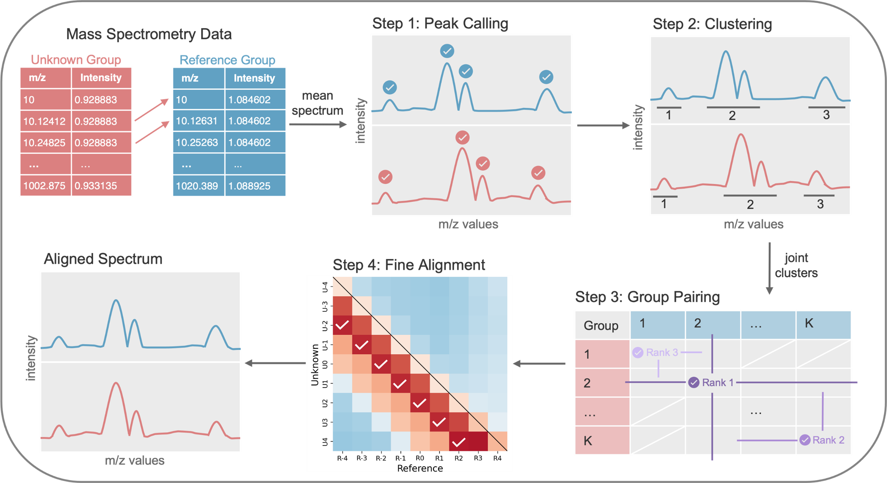

# GALAXY

Anji Deng and Qihuang Zhang*



**GALAXY (Group Alignment of mass spectrometry data)** is a peak-group-based algorithm for aligning mass spectrometry (MS) spectra onto a common m/z grid. It is designed for imaging and spatial metabolomics data such as MALDI-MS, where spectra from different runs or tissues often exhibit small m/z shifts that prevent direct comparison.

By aligning an “unknown” spectrum (or dataset) to a reference while *forcing* matched spectra to share the same m/z values, GALAXY enables downstream analyses such as:
- joint spatial segmentation across tissues or time points  
- classification using combined datasets  
- other multi-sample analyses that require a common m/z grid  

This repository contains the reference Python implementation used in the GALAXY manuscript. 

---

## Repository layout

- `GalaxyPython/`  
  Core Python implementation of GALAXY (alignment and peak-group functions).

- `CodeInPaper/`  
  Scripts used to generate the figures and results in the manuscript
  (simulation study, macrophage regression data, canine sarcoma data, etc.).

- `Tutorial_GALAXY.ipynb`  
  A Jupyter notebook tutorial that walks through aligning two MALDI datasets
  (e.g., Week 2 and Week 5 regression samples) and preparing them for joint
  segmentation.

- `LICENSE`  
  License for using and modifying this code.

---

## Installation

Clone the repository:

```bash
git clone https://github.com/StaGill/GALAXY.git
cd GALAXY
```

You can either add GalaxyPython to your PYTHONPATH, or install it as an editable package, e.g.:

```bash
pip install -e GalaxyPython
```

After installation, you should be able to import GALAXY in Python, for example:

```python
import MALDIpython as MALDIpy 
```

## Quick start

A minimal example of running GALAXY on two MALDI datasets is given in
Tutorial_GALAXY.ipynb. The basic workflow is:

1. Load two MALDI datasets (e.g., two time points or two tissues) and their
spatial coordinates (optional).

2. Wrap them into AnnData objects (using scanpy / anndata).

3. Normalize intensities per spectrum.

4. Run GALAXY:
- peak calling and peak grouping
- group matching
- fine alignment

5. Extract the aligned spectra and use them for joint analyses
(e.g., PCA + Harmony + clustering).

In simplified form, the core steps look like:
```python
import scanpy as sc
import MALDIpython as MALDIpy  # GALAXY implementation

# X = spectra, var = m/z table, obs = coordinates (see Tutorial_GALAXY.ipynb)
MALDIdataAnn1 = ...
MALDIdataAnn2 = ...

# Normalize per spectrum
sc.pp.normalize_per_cell(MALDIdataAnn1)
sc.pp.normalize_per_cell(MALDIdataAnn2)

# Peak calling + peak groups
PeakGroup = MALDIpy.PeakCalling(MALDIdataAnn1, MALDIdataAnn2)

# Alignment object
ExactAlign = MALDIpy.AnnDataMALDI(MALDIdataAnn1, MALDIdataAnn2)

# Group similarity and greedy matching
ExactAlign.get_corr_peakgroup_refined(PeakGroup.jointcluster)
ExactAlign.greedy_match()

# Fine alignment and summary
ExactAlign.fine_align(threshould=0.2, ignore=True)
alignment_results = ExactAlign.summarize()
```

Please refer to Tutorial_GALAXY.ipynb for a fully worked example with real
data and plots.


## Reproducing results from the manuscript

The scripts in CodeInPaper/ (to be documented) correspond to the main analyses:

- Simulation study (mouse pancreas MALDI)
Evaluates alignment error under controlled peak shifts and noise.

- Atherosclerosis regression (macrophage metabolomics)
Aligns Week 5 MALDI spectra to Week 2, evaluates performance using anchor m/z
points, and performs joint spatial segmentation.

- Canine sarcoma data
Aligns cancer tissue spectra to normal tissue, assesses classification
performance before and after alignment, and performs joint clustering across
cancer samples.

Data sources:

- Mouse pancreas MALDI: https://doi.org/10.5281/zenodo.3607915

- Atherosclerosis regression MALDI: available from the data owners upon reasonable request.

- Canine carcinoma MALDI: PRIDE accession PXD010990
(https://proteomecentral.proteomexchange.org/cgi/GetDataset?ID=PXD010990)